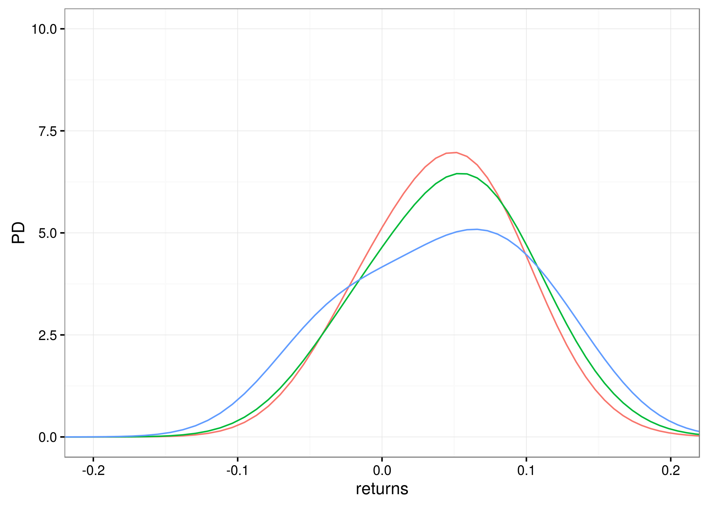
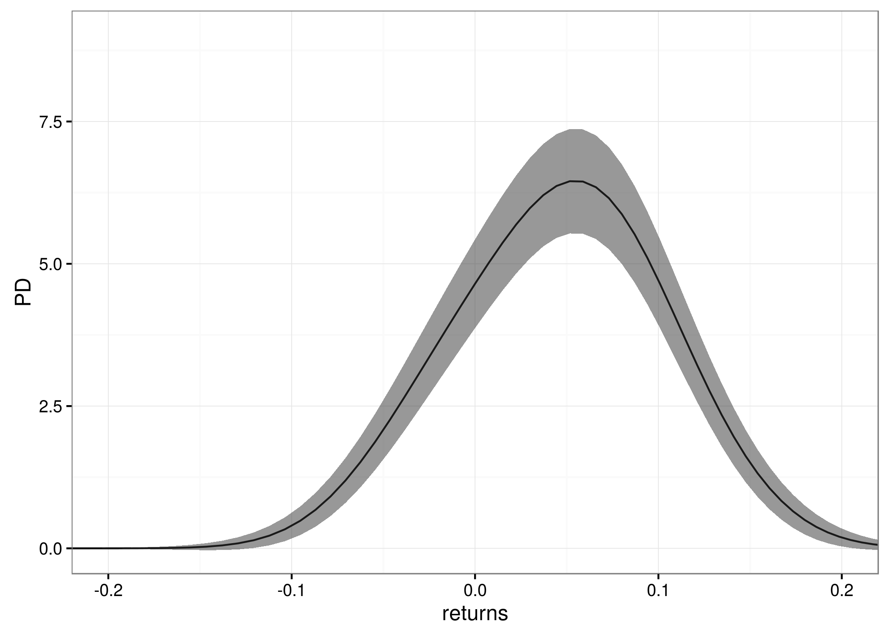
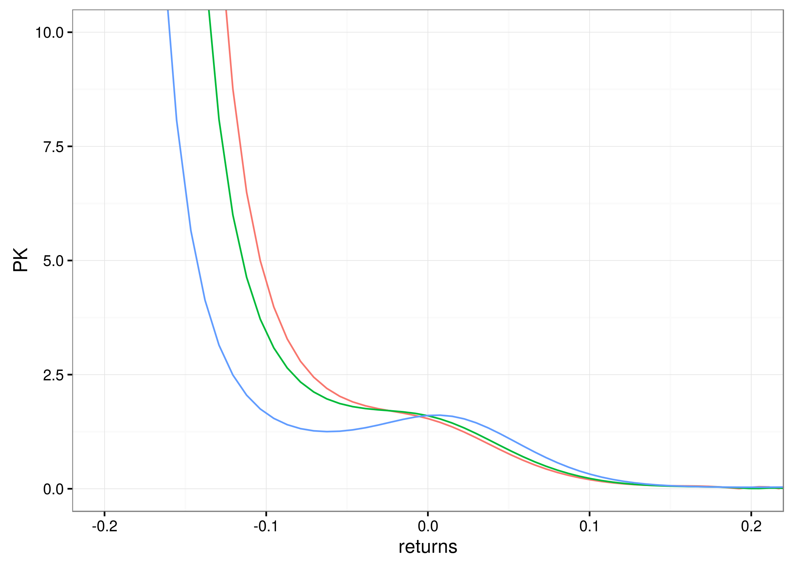
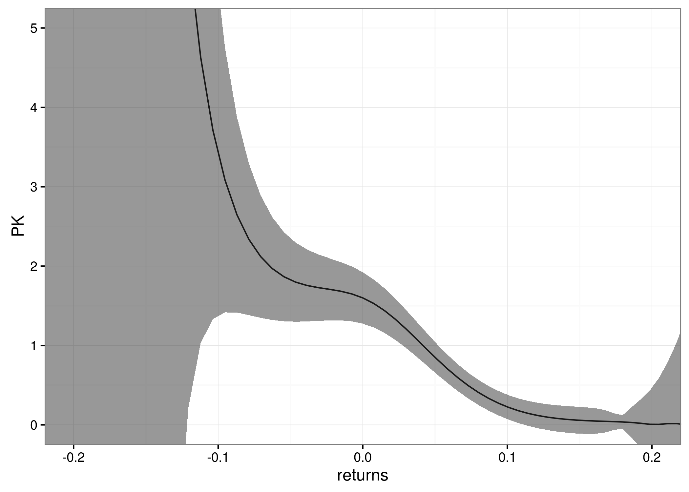
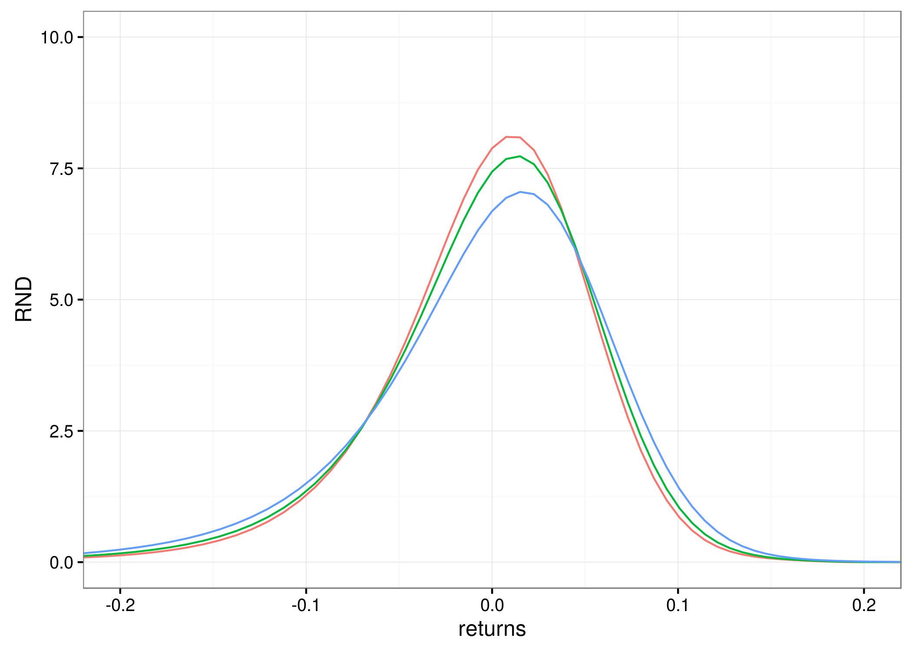

[](http://quantlet.de/)

## [](http://quantlet.de/) **epkLocLinRndLocConstPD** [](http://quantlet.de/)

```yaml

Name of QuantLet : epkLocLinRndLocConstPD

Published in : pricing_kernels_and_implied_volatility

Description : 'Estimates and plots (yearly) empirical pricing kernels (EPK), risk neutral densities
(RND) and physical densities (PD) of DAX 30 index return conditional on 20% (red curve), 40% (green
curve) and 60% (blue curve) quantiles of volatility index VDAX-NEW (current year), and time to
maturity 1 month. Local linear kernel regression is used for estimation of the conditional risk
neutral density and local constant kernel regression is used for estimation of conditional physical
density. Moreover, 95% confidence intervals have been calculated for PK, RND and PD conditioned by
40% quantile of VDAX-NEW and time to maturity 1 month. All results are shown on a continuously
compounded 1-month period returns scale. '

Keywords : 'pricing kernel, risk neutral density, physical density, kernel regression, volatility,
dax, vdax, kernel, regression, risk, risk aversion'

Author : Roman Lykhnenko

Submitted : Roman Lykhnenko

Datafile : C_2012.csv, timeSeriesDaxVdax.csv, locLinBW.RData

Input: 
- timeSeriesDaxVdax.csv: Time series of VDAX-NEW index and DAX 30 index
- C_2012.csv: Call prices 2012
- locLinBW.RData: Bandwidths used for estimation of RND based on local linear kernel regression

Output: 
- epkLocLinRndLocConstPD2012.RData: 'Estimated conditional pricing kernels, risk neutral and
physical densities'
- epkLocLinRndLocConstPD_PD_2012.png: 'Plot of estimated physical densities conditional on 20% (red
curve), 40% (green curve) and 60% (blue curve) quantiles of volatility index VDAX-NEW'
- epkLocLinRndLocConstPD_PD_CI_2012.png: 'Plot of estimated physical density conditioned by 40%
quantile of VDAX-NEW and time to maturity 1 month with 95% confidence intervals'
- epkLocLinRndLocConstPD_PK_2012.png: 'Plot of estimated pricing kernels conditional on 20% (red
curve), 40% (green curve) and 60% (blue curve) quantiles of volatility index VDAX-NEW'
- epkLocLinRndLocConstPD_PK_CI_2012.png: 'Plot of estimated pricing kernel conditioned by 40%
quantile of VDAX-NEW and time to maturity 1 month with 95% confidence intervals'
- epkLocLinRndLocConstPD_RND_2012.png: 'Plot of estimated risk neutral densities conditional on 20%
(red curve), 40% (green curve) and 60% (blue curve) quantiles of volatility index VDAX-NEW'
- epkLocLinRndLocConstPD_RND_CI_2012.png: 'Plot of estimated risk neutral density conditioned by
40% quantile of VDAX-NEW and time to maturity 1 month with 95% confidence intervals'

Example : 'The estimated conditional pricing kernels, risk neutral and physical densities for year
2012. For more details see Description.'

```












### R Code:
```r
# install and load packages
libraries = c("dplyr", "MASS", "gridExtra", "ggplot2", "Matrix", "parallel", "caTools", 
              "np", "RColorBrewer")
lapply(libraries, function(x) if (!(x %in% installed.packages())) {
  install.packages(x)
})
lapply(libraries, library, quietly = TRUE, character.only = TRUE)

# set working directory 
setwd("/home/rama/Masterarbeit/pricing_kernels_and_implied_volatility")

# load precomputed object
load("epkLocLinRndLocConstPD/locLinBW.RData")


year                   = 2012
timeToMaturity         = 1/12
horizonPhysicalDensity = 300


# path to the file with option data
pathToData = paste("epkLocLinRndLocConstPD/C_", as.character(year),".csv", sep = "")

# read option data
C_2012 = read.csv(pathToData, sep = ",", header = TRUE)
C_2012 = na.omit(C_2012)


# load Dax and VDax data
bothIndexesDax      = read.csv("epkLocLinRndLocConstPD/timeSeriesDaxVdax.csv")
bothIndexesDax      = bothIndexesDax[,c("Date", "DAX","VDAX")]
bothIndexesDax$Date = as.Date(as.character(bothIndexesDax$Date), 
                              "%Y-%m-%d")

# subset only those values of DAX, VDAX where Euribor rates are available
bothIndexesDax = bothIndexesDax[bothIndexesDax$Date >= as.Date('2000-01-01'),]
bothIndexesDax = bothIndexesDax[bothIndexesDax$Date <= as.Date('2013-07-31'),]


# for selection of quantiles
bothIndexesDaxQuant = bothIndexesDax[bothIndexesDax$Date <= as.Date(paste(as.character(year),
                                                                          "-12-31", sep = "")),]
bothIndexesDaxQuant = bothIndexesDaxQuant[bothIndexesDaxQuant$Date >= as.Date(paste(as.character(year - 1),
                                                                                    "-12-31", sep = "")),]

ttmFraction  = timeToMaturity
specifyQuant = c(.2, .4, .6)

# define VDAX levels for which PK to be calculated
percentilesVDAX = round(quantile(bothIndexesDaxQuant$VDAX, 
                                 specifyQuant), 2)
vola_levels     = as.character(percentilesVDAX)

listRndPDpk     = list()

for (vola_item in vola_levels){
  print(vola_item)
  VDAX_level = as.numeric(vola_item)
  
  #
  # option data preparation
  #
  
  # add ttm in days
  C_2012$ttmDays = (C_2012$TTM) * 365
  
  # moneyness(Strike/S_0)
  C_2012$moneyness = C_2012$EXERCISE_PRICE/C_2012$DAX
  
  #
  moneyness_est = seq(0.75, 1.5, length.out = 100)
  
  #
  # rescale option price
  #
  
  # option price
  C = C_2012[,"settlement"]
  
  # discount factor
  D = exp(-(C_2012$euriborRate) * C_2012$TTM)
  
  # scale by discount factor
  C = C/D
  
  # scale by forward price
  C= C/C_2012$DAX
  
  
  # subset option data used for estimation
  optionData      = cbind(C, C_2012[, c("TTM", "moneyness", "VDAX", "Date")])
  optionData$Date = as.Date(as.character(optionData$Date))
  
  # bandwidth specification as used for estimtion of the RND 
  hTTM_RND  = bandwidthMonKfoldCVyears[[as.character(year)]]$matur
  hMon_RND  = bandwidthMonKfoldCVyears[[as.character(year)]]$mon
  hVDAX_RND = bandwidthMonKfoldCVyears[[as.character(year)]]$vola
  
  #
  # Function performing local linear kernel regression
  #
  
  locLinRegression = function(moneynessValue, 
                              tauValue, 
                              vdaxValue,
                              data = optionData,
                              h.TTM,
                              h.moneyness,
                              h.VDAX,
                              output="C"){
    
    # u_i, independent variables
    regressors = data[, c("TTM", "moneyness", "VDAX")]
    
    # response(dependent) variable of regression equation
    DependentVar = data[, output]
    n            = nrow(regressors)
    Kernel       = rep(0, n)
    
    # 3dim kernel function
    for (j in 1:n) {
      Kernel[j] = (dnorm((regressors$TTM[j] - tauValue)/h.TTM, mean = 0, sd = 1, log = FALSE)/h.TTM) * 
        (dnorm((regressors$VDAX[j] - vdaxValue)/h.VDAX, mean = 0, sd = 1, log = FALSE)/h.VDAX) * 
        (dnorm((regressors$moneyness[j] - moneynessValue)/h.moneyness, mean = 0, 
               sd = 1, log = FALSE)/h.moneyness)
    }
    
    Kernel_matrix = Diagonal(n = length(Kernel), Kernel)
    
    regressors_minus_u = cbind(regressors$TTM - tauValue, regressors$VDAX - vdaxValue, 
                               regressors$moneyness - moneynessValue)
    
    Omega = cbind(1, regressors_minus_u)
    
    invertedExpression = tryCatch(solve(t(Omega) %*% Kernel_matrix %*% Omega), error = function(c) NA)
    
    if (is.element(NA, as.vector(invertedExpression))) {
      FirstOrderDerMon = NA
      constTerm        = NA
    }
    else {
      estCoef          = invertedExpression %*% t(Omega) %*% Kernel_matrix %*% DependentVar
      FirstOrderDerMon = estCoef[4]
      constTerm        = estCoef[1]
    }
    
    out = list(firstOrderDerivativeMoneyness = FirstOrderDerMon, constTerm = constTerm)
    
    out
    
  }
  
  
  #
  # 1dim RND by numerical differentiation of obtained 1st order derivative
  #
  
  coefficientsAll = mclapply(moneyness_est,
                             locLinRegression,
                             tauValue    = ttmFraction, 
                             vdaxValue   = VDAX_level,
                             h.TTM       = hTTM_RND ,
                             h.moneyness = hMon_RND,
                             h.VDAX      = hVDAX_RND)
  
  regression1DerMon = sapply(coefficientsAll, 
                             FUN = function(listItem){
                               listItem[["firstOrderDerivativeMoneyness"]] 
                             })
  
  # increment moneynes to compute derivtive
  delta          = 0.005
  moneyness_est0 = moneyness_est + delta
  
  #
  # compute regression at the changed moneyness
  # 
  coefficientsAll0 = mclapply(moneyness_est0,
                              locLinRegression,
                              tauValue    = ttmFraction, 
                              vdaxValue   = VDAX_level,
                              h.TTM       = hTTM_RND ,
                              h.moneyness = hMon_RND,
                              h.VDAX      = hVDAX_RND)
  
  regression1DerMon0 = sapply(coefficientsAll0, 
                              FUN = function(listItem){
                                listItem[["firstOrderDerivativeMoneyness"]] 
                              })
  
  RND_given_ttm_final = (regression1DerMon0 - regression1DerMon)/delta
  
  RND_given_ttm = abs(RND_given_ttm_final * moneyness_est)
  excess_return = log(moneyness_est)
  
  # plot(excess_return, abs(RND_given_ttm), type="p")
  # trapz(excess_return, abs(RND_given_ttm))
  
  #
  # Confidence Intervals
  #
  
  # calculation of the conditional variance
  optionDataForResidualsIndex = seq(1, nrow(optionData), 280)
  optionDataForResiduals      = optionData[optionDataForResidualsIndex, ]
  
  
  replicateOptionDataForResiduals = lapply(1:nrow(optionDataForResiduals),  
                                           FUN = function(index) optionDataForResiduals)
  
  # function to perform loc lin regression used for calculation of conditional variance
  locLinRegressionForRes = function(moneynessValue, # point at which regression to be calculated
                                    tauValue, 
                                    vdaxValue,
                                    data = optionData,
                                    output = "C"){
    
    # u_i, independent variables
    regressors = data[,c("TTM","moneyness", "VDAX")]
    
    # response(dependent) variable of regression equation
    DependentVar = data[, output]
    
    # bandwidth specification
    h.TTM       = sd(regressors$TTM) * nrow(regressors)^(-1/(4 + 3))
    h.moneyness = sd(regressors$moneyness) * nrow(regressors)^(-1/(4 + 3))
    h.VDAX      = sd(regressors$VDAX) * nrow(regressors)^(-1/(4 + 3))
    
    n      = nrow(regressors)
    Kernel = rep(0, n)
    
    # 3dim kernel function
    for (j in 1:n) {
      
      Kernel[j] = (dnorm((regressors$TTM[j] - tauValue)/h.TTM, mean = 0, sd = 1, log = FALSE)/h.TTM) * 
        (dnorm((regressors$VDAX[j] - vdaxValue)/h.VDAX, mean = 0, sd = 1, log = FALSE)/h.VDAX) * 
        (dnorm((regressors$moneyness[j] - moneynessValue)/h.moneyness, mean = 0, 
               sd = 1, log = FALSE)/h.moneyness)
    }
    
    Kernel_matrix = Diagonal(n = length(Kernel), Kernel)
    
    regressors_minus_u = cbind(regressors$TTM - tauValue,
                               regressors$VDAX - vdaxValue,
                               regressors$moneyness - moneynessValue)
    
    Omega = cbind(1, regressors_minus_u)
    
    invertedExpression = tryCatch(solve(t(Omega) %*% Kernel_matrix %*% Omega), error = function(c) NA)
    
    if (is.element(NA, as.vector(invertedExpression))) {
      FirstOrderDerMon = NA
      constTerm        = NA
    }
    else {
      estCoef          = invertedExpression%*%t(Omega)%*%Kernel_matrix%*%DependentVar
      FirstOrderDerMon = estCoef[4]
      constTerm        = estCoef[1]
    }
    
    out = list(firstOrderDerivativeMoneyness = FirstOrderDerMon,
               constTerm = constTerm)
    
    out
    
  }
  
  
  # preparation to compute residuals
  forResiduals = mcmapply(locLinRegressionForRes,
                          optionDataForResiduals$moneyness,
                          optionDataForResiduals$TTM,
                          optionDataForResiduals$VDAX,
                          data=replicateOptionDataForResiduals)
  
  estimOptionPrice = unlist(forResiduals["constTerm",])
  
  optionDataForResiduals$estimOptionPrice = estimOptionPrice
  
  # squared residuals
  optionDataForResiduals$squaredResid = (optionDataForResiduals$C - 
                                           optionDataForResiduals$estimOptionPrice)^2
  
  
  # local linear regresson with squared residual as a dependent variable
  coefficientsResidualsReg = mclapply(moneyness_est,
                                      locLinRegressionForRes,
                                      tauValue  = ttmFraction, 
                                      vdaxValue = VDAX_level,
                                      data      = optionDataForResiduals,
                                      output    = "squaredResid")
  
  conditionalVariance = sapply(coefficientsResidualsReg, 
                               FUN = function(listItem){
                                 listItem[["constTerm"]] 
                               })
  
  
  kernelConstant = 0.2115711
  
  # bandwidth specification for estimtion of the joint density, ROT
  hTTMjointDen = sd(optionData$TTM) * nrow(optionData)^(-1/(4 + 3)) * (4/5)^(1/(3 + 4))
  hMonjointDen = sd(optionData$moneyness) * nrow(optionData)^(-1/(4 + 3)) * (4/5)^(1/(3 + 4))
  hVDAXjointDen = sd(optionData$VDAX) * nrow(optionData)^(-1/(4 + 3)) * (4/5)^(1/(3 + 4))
  
  # joint density of moneyness, tau, vola
  joinDensityRegressors = function(pointMon,
                                   pointTTM,
                                   pointVDAX,
                                   hMon,
                                   hTTM,
                                   hVDAX,
                                   data=optionData){
    
    jointDens = mean((1/hMon) * (1/hTTM) * (1/hVDAX) * dnorm((data$moneyness - pointMon)/hMon,
                                                             mean=0, 
                                                             sd=1, 
                                                             log=FALSE) * dnorm((data$TTM - pointTTM)/hTTM,
                                                                                mean=0, 
                                                                                sd=1, 
                                                                                log=FALSE) * dnorm((data$VDAX - pointVDAX)/hVDAX,
                                                                                                   mean=0, 
                                                                                                   sd=1, 
                                                                                                   log=FALSE))
    
    jointDens 
  }
  
  jointDenValues = unlist(mclapply(moneyness_est,
                                   joinDensityRegressors,
                                   pointTTM  = ttmFraction, 
                                   pointVDAX = VDAX_level,
                                   hMon      = hMonjointDen,
                                   hTTM      = hTTMjointDen,
                                   hVDAX     = hVDAXjointDen,
                                   data      = optionData))
  
  sigmaSquared       = (moneyness_est^2) * (1/(3 * sqrt(pi))^3) * kernelConstant * 
    abs(conditionalVariance) / jointDenValues
  factorDistribution = nrow(optionData) * ((hMon_RND)^4) * (hMon_RND * hTTM_RND * 
                                                              hVDAX_RND)
  rndVariance        = abs(sigmaSquared/factorDistribution)
  
  
  rndLocLinWithCI = data.frame(excess_return, 
                               RND_given_ttm,
                               rndLocLinUp   = RND_given_ttm + qnorm(0.95, 0, 1) * sqrt(rndVariance),
                               rndLocLinDown = RND_given_ttm - qnorm(0.95, 0, 1) * sqrt(rndVariance)) 
  
  colnames(rndLocLinWithCI) = c("market_return", 
                                "RNDlocLin",
                                "rndLocLinUp",
                                "rndLocLinDown") 
  
  #
  # Local constant estimation of PD ################################################
  #
  
  # used in contemporaneous approach for calculation of physical density
  dateHistDensity = as.Date(paste(as.character(year), "-12-31", sep = ""))
  
  #
  # physical density estimation (using contemporaneous method) ##################
  #
  
  # maturity for which historical density to be calculated
  tauDays = round(ttmFraction*365, 0)
  
  # how many observations from past to use for estimation of hist. density
  horizon = horizonPhysicalDensity
  
  # take only those rows that are earlier than dateHistDensity
  bothIndexesDax = bothIndexesDax[bothIndexesDax$Date <= dateHistDensity, ] 
  
  # supposed to contain returns of the index observed over each maturity
  returnsDaxVdax           = bothIndexesDax[1:horizon, c("DAX","VDAX")]
  colnames(returnsDaxVdax) = c('DaxReturns','VDAXlevel')
  
  lengthBothIndexes = length(bothIndexesDax[,1])
  
  for(i in 1:horizon){  
    returnsDaxVdax[i,1] = log(bothIndexesDax$DAX[lengthBothIndexes-i]/(bothIndexesDax$DAX[lengthBothIndexes-i-tauDays]))
    returnsDaxVdax[i,2] = bothIndexesDax$VDAX[lengthBothIndexes-i] 
  }   
  
  
  #
  # Local const regression(NW) for esimation of conditional physical density
  #
  
  # specify bandwidth
  bwC = npcdensbw(xdat     = returnsDaxVdax$VDAXlevel,
                  ydat     = returnsDaxVdax$DaxReturns,
                  bwmethod = "normal-reference")
  
  hDaxReturnsJoint = 1.5 * bwC$ybw
  hVDAXJoint       = bwC$xbw
  hVDAXmarginal    = bwC$xbw
  
  # conditional kernel density estimation
  conditDensity = function(pointReturns,
                           pointVDAX, 
                           hDaxReturnsJoint, 
                           hVDAXJoint, 
                           hVDAXmarginal,
                           returnsDaxVdax){
    
    jointDens = mean((1/hDaxReturnsJoint) * (1/hVDAXJoint) * dnorm((returnsDaxVdax[,1] - pointReturns)/hDaxReturnsJoint, 
                                                                   mean = 0, sd = 1, log = FALSE) * dnorm((returnsDaxVdax[,2] - pointVDAX)/hVDAXJoint,
                                                                                                          mean = 0, sd = 1, log = FALSE) )
    
    marginalDenVDAX = mean( (1/hVDAXmarginal) * dnorm((returnsDaxVdax[,2] - pointVDAX)/hVDAXmarginal,
                                                      mean = 0, sd = 1, log = FALSE) )
    
    outCondDensity = jointDens/marginalDenVDAX
    
    nFactor =  nrow(returnsDaxVdax)
    c1      = hDaxReturnsJoint
    c2      = hVDAXJoint
    confInt = ((1/(4 * 3.14)) * outCondDensity/(c1 * c2 * marginalDenVDAX))/nFactor
    
    out = list(conditionalDensity = outCondDensity, confidenceInterval = confInt)
    
  }
  
  # range of log returns (to calculate values of the density at these points)
  eurostoxx_range = excess_return # from file with RND estimation
  
  
  eurostoxx_hist_densityValues = lapply(eurostoxx_range, conditDensity, 
                                        pointVDAX        = VDAX_level,
                                        hDaxReturnsJoint = hDaxReturnsJoint,
                                        hVDAXJoint       = hVDAXJoint,
                                        hVDAXmarginal    = hVDAXmarginal,
                                        returnsDaxVdax   = returnsDaxVdax)
  
  # get density values, and variance separately
  
  densityValues =sapply(eurostoxx_hist_densityValues, FUN = function(listItem){
    listItem[[1]]
  })
  
  variancePD = sapply(eurostoxx_hist_densityValues, FUN = function(listItem){
    listItem[[2]]
  })
  
  # data frame with density values and CI
  dataPDlocConstWithCI = data.frame(returns = eurostoxx_range, PhysicalDensityLocalConstValue = densityValues, 
                                    pdLocalConstUpperBound = densityValues + qnorm(0.95, 0, 1) * sqrt(variancePD), 
                                    pdLocalConstLowerBound = densityValues - qnorm(0.95, 0, 1) * sqrt(variancePD))
  #
  # EPK ##########################################################################
  #
  
  PK_value = (rndLocLinWithCI$RNDlocLin)/(dataPDlocConstWithCI$PhysicalDensityLocalConstValue)
  
  varianceEPK = (1/(dataPDlocConstWithCI$PhysicalDensityLocalConstValue)) * rndVariance + 
    ((1/(dataPDlocConstWithCI$PhysicalDensityLocalConstValue))^4) * ((rndLocLinWithCI$RNDlocLin)^2) * 
    variancePD
  
  rndPDpk = data.frame(returns                        = eurostoxx_range, 
                       PricingKernel                  = PK_value,
                       pkUpperBound                   = PK_value + qnorm(0.95, 0, 1) * sqrt(varianceEPK),
                       pkLowerBound                   = PK_value  - qnorm(0.95, 0, 1) * sqrt(varianceEPK),
                       PhysicalDensityLocalConstValue = densityValues,
                       pdLocalConstUpperBound         = densityValues + qnorm(0.95, 0, 1) * sqrt(variancePD),
                       pdLocalConstLowerBound         = densityValues - qnorm(0.95, 0, 1) * sqrt(variancePD),
                       RND_given_ttm,
                       rndLocLinUp                    = RND_given_ttm + qnorm(0.95, 0, 1) * sqrt(rndVariance),
                       rndLocLinDown                  = RND_given_ttm - qnorm(0.95, 0, 1) * sqrt(rndVariance))
  
  listRndPDpk[[vola_item]] = rndPDpk
} 

for(itemN in (1:length(vola_levels))){
  listRndPDpk[[vola_levels[itemN]]]$VDAXlevel = paste0(vola_levels[itemN],
                                                       "_",
                                                       100*specifyQuant[itemN],
                                                       "%")
}

# bind all elements of the list in one data frame
dataAllVDAXlevels = do.call("rbind", listRndPDpk)

# save as Rdata object
save(dataAllVDAXlevels, 
     listRndPDpk,
     year, 
     specifyQuant,
     vola_levels,
     timeToMaturity,
     vola_item,
     hMon_RND,
     horizonPhysicalDensity,
     hDaxReturnsJoint,
     file = paste0("epkLocLinRndLocConstPD/epkLocLinRndLocConstPD", year, ".RData"))


load(paste0("epkLocLinRndLocConstPD/epkLocLinRndLocConstPD", year, ".RData"))

#
# Plotting part 
#

# RNDs in one plot
rndAll = ggplot(data       = dataAllVDAXlevels,
                aes(x      = returns, 
                    y      = RND_given_ttm, 
                    colour = VDAXlevel)) +
  geom_line() +
  coord_cartesian(xlim = c(-0.2, 0.2), ylim = c(0,10)) +
  theme_bw() +
  theme(legend.position = "none") +
  xlab("returns") +
  ylab("RND")

ggsave(paste("epkLocLinRndLocConstPD/epkLocLinRndLocConstPD",
             "_RND_",
             as.character(year), 
             ".png", sep = ""),
       rndAll, 
       width = 7, height = 5)

# PDs
pdAll = ggplot(data       = dataAllVDAXlevels,
               aes(x      = returns, 
                   y      = PhysicalDensityLocalConstValue, 
                   colour = VDAXlevel)) + 
  geom_line() +
  coord_cartesian(xlim = c(-0.2, 0.2), ylim = c(0,10)) +
  theme_bw() +
  theme(legend.position = "none") +
  xlab("returns") +
  ylab("PD")

ggsave(paste("epkLocLinRndLocConstPD/epkLocLinRndLocConstPD",
             "_PD_",
             as.character(year), 
             ".png", sep = ""),
       pdAll, 
       width = 7, height = 5)

# PKs
pkAll = ggplot(data       = dataAllVDAXlevels,
               aes(x      = returns, 
                   y      = PricingKernel, 
                   colour = VDAXlevel )) +
  geom_line() +
  coord_cartesian(xlim = c(-0.2, 0.2), ylim = c(0,10)) +
  theme_bw() +
  theme(legend.position = "none") +
  xlab("returns") +
  ylab("PK")


ggsave(paste("epkLocLinRndLocConstPD/epkLocLinRndLocConstPD",
             "_PK_",
             as.character(year), 
             ".png", sep = ""),
       pkAll, 
       width = 7, height =5)

#
# Conffidence intervals 
#

# PD
pdCI = ggplot(data = dataAllVDAXlevels %>%
                filter(VDAXlevel == paste0(vola_levels[2],
                                           "_",
                                           100*specifyQuant[2],
                                           "%")),
              aes(x = returns))+
  geom_line(aes(y = PhysicalDensityLocalConstValue), size = 0.5, colour = "black") +
  geom_ribbon(aes(ymin = pdLocalConstLowerBound, ymax = pdLocalConstUpperBound), alpha = 0.5) +
  coord_cartesian(xlim = c(-0.2, 0.2), ylim = c(0,9)) +
  theme_bw() +
  theme(legend.position = "none") +
  xlab("returns") +
  ylab("PD")

ggsave(paste("epkLocLinRndLocConstPD/epkLocLinRndLocConstPD",
             "_PD_CI_",
             as.character(year), 
             ".png", sep = ""),
       pdCI, 
       width = 7, height = 5)

# RND
rndCI = ggplot(data = dataAllVDAXlevels %>%
                 filter(VDAXlevel == paste0(vola_levels[2],
                                            "_",
                                            100*specifyQuant[2],
                                            "%")),
               aes(x = returns))+
  geom_line(aes(y = RND_given_ttm), size = 0.5, colour = "black") +
  geom_ribbon(aes(ymin = rndLocLinDown, ymax = rndLocLinUp ), alpha = 0.5) +
  coord_cartesian(xlim = c(-0.2, 0.2), ylim = c(0,9)) +
  theme_bw() +
  theme(legend.position = "none") +
  xlab("returns") +
  ylab("RND")


ggsave(paste("epkLocLinRndLocConstPD/epkLocLinRndLocConstPD",
             "_RND_CI_",
             as.character(year), 
             ".png", sep = ""),
       rndCI, 
       width = 7, height = 5)


# PK
pkCI = ggplot(data = dataAllVDAXlevels %>%
                filter(VDAXlevel == paste0(vola_levels[2],
                                           "_",
                                           100*specifyQuant[2],
                                           "%")),
              aes(x = returns)) +
  geom_line(aes(y = PricingKernel), size = 0.5, colour = "black") +
  geom_ribbon(aes(ymin = pkLowerBound, ymax = pkUpperBound ), alpha = 0.5) +
  coord_cartesian(xlim = c(-0.2, 0.2), ylim = c(0,5)) +
  theme_bw() +
  theme(legend.position = "none") +
  xlab("returns") +
  ylab("PK")

ggsave(paste("epkLocLinRndLocConstPD/epkLocLinRndLocConstPD",
             "_PK_CI_",
             as.character(year), 
             ".png", sep = ""),
       pkCI, 
       width = 7, height = 5)

```
